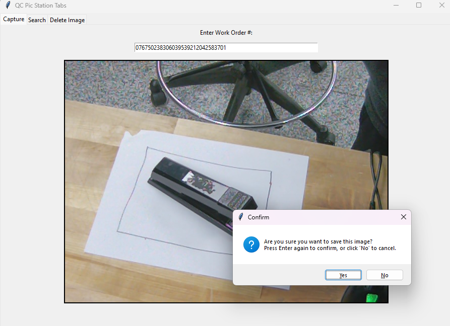

# QC Pic Station App

The QC Pic Station application is designed to simplify and improve the process of capturing, storing, and retrieving quality control images in our production workflow. This tool allows staff to quickly take a picture from a connected IP camera, label it with a work order number by scan the work orders, and store it in a secure, searchable database
---

## Table of Contents
- [Installation](#installation)
- [Usage](#usage)
- [Project Structure](#project-structure)

---

## Installation

### 1. Clone the repository

```bash
git clone https://github.com/ANHVU280598/QC_Pic_Station
cd QC_Pic_Station
```
### 2. Set up Env
```bash
python -m venv venv
# On Windows
venv\Scripts\activate
# On macOS/Linux
source venv/bin/activate
pip install -r requirements.txt
```
### 3. Initial DB and Package the App Using Pyinstaller
```bash
python initDb.py
pyinstaller main.py
```
It will create main.spec and modify it as below:
```bash
a = Analysis(
    ['main.py'],
    pathex=['.'],
    binaries=[('myenv/Lib/site-packages', '.')],
    datas=[('work_orders.db', '.')],
    hiddenimports=['cam_app', 'db_handler', 'delete_image_tab', 'initDb', 'search_app'],
```
```bash
pyinstaller main.spec
```
## Usage
### 1. Run The App 
```bash
cd QC_Pic_Station/dist/
main.exe
```
### 2. Capture tab

### 3. Search tab


## Project Structure
```bash
QC_PIC_STATION/      
├── cam_app.py    
├── db_handler.py  
├── delete_image_tab.py  
├── initDb.py  
├── main.py                                       
├── requirements.txt
├── search.py  
└── README.md                       
```              